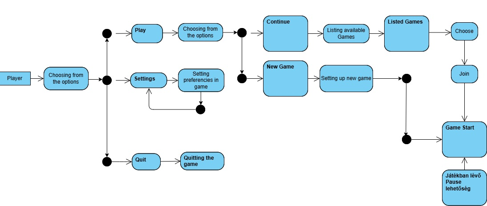
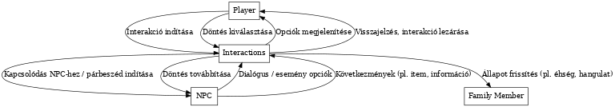

# Analízis Modell

## Bevezetés

A „Piotr naplója – Egy család a holnap küszöbén” című játékterv egy narratív-
központú, morális döntésekre és túlélési stratégiákra építő szimuláció, amely 
egy fiktív szocialista ország gazdasági összeomlásának időszakában játszódik. A 
játék középpontjában Piotr, a családfő áll, aki napról napra küzd meg a 
rendszerszintű hiány, a társadalmi nyomás és a személyes morális dilemmák között,
miközben próbálja életben tartani a családját.

Az analízis modell célja a probléma tér struktúrájának feltárása: azaz azoknak a
 fogalmaknak, entitásoknak és viszonyoknak az azonosítása, amelyek a játék 
 világának alapvető összetevői. Ennek megfelelően a következő szakaszban egy 
 kezdeti osztálydiagram készül, amely a játék világának fő komponenseit, azok 
 tulajdonságait és kapcsolatait mutatja be.

## Kezdeti osztálydiagram

Játékos

- A játék fő karaktere, akinek tulajdonságai közé tartozik az éhségszint, 
stressz, alkoholállapot, reputáció és munkabeosztás. A játékos állapotai 
befolyásolják a túlélést és a döntéseket.

Családtag

- A családtagoknak kizárólag éhségszintjük van, ami meghatározza életminőségüket
 és túlélési esélyeiket.

Munkahely

- Különböző típusú munkahelyek (pl. autószerelő, bolt, iroda), amelyekhez a 
játékos tartozhat és amelyek meghatározzák a napi tevékenységeket és jövedelmet.

Műszak

- A nap egy adott időszaka, amelyhez a munkavégzés vagy egyéb tevékenység 
kapcsolódik.

Tárgy

- A játékban használható, gyűjthető vagy kereskedhető eszközök és árucikkek.

Esemény

- A játék során bekövetkező döntési helyzetek, amelyek változást hoznak a 
történetben vagy a karakter állapotában.

MorálisDöntés

- Olyan választási lehetőségek, amelyek többféle következménnyel járhatnak és 
alakítják a történet menetét.

FeketepiacKapcsolat

- A nem hivatalos árubeszerzési és kereskedelmi lehetőségek rendszere.

NapiNapló

- Az egyes napok eseményeit, kiadásait és a család állapotát összefoglaló napló.

JátékÁllapot

- Globális mutatók, például reputáció, idő előrehaladása és túlélési esélyek, 
amelyek a játék egészére hatnak.

### Osztálydiagram

### Osztályok Felsorolása

Main menu

- Az Main menu osztály a játék főmenüjét kezeli, ahol a játékos elindíthat új 
játékot, folytathat egy mentést, vagy módosíthatja a beállításokat. Tartalmazza 
a menüpontok listáját és a kiválasztott elemet. Metódusai felelősek a menü 
megjelenítéséért, a navigációért és a választás feldolgozásáért.

New game

- A New game osztály az új játék elindításáért felel, új játékállapotot hoz létre
 az alapértelmezett beállításokkal. Attribútumaiban tárolja az induló 
 karaktereket, helyszíneket és kezdeti játékparamétereket. Metódusai az új játék
  inicializálását és a játékos számára elérhető első lépések beállítását végzik.

Continue

- A Continue osztály lehetővé teszi a korábbi játékállapot betöltését. 
Attribútumai a mentett állományok listája és a kiválasztott mentés. Metódusai a 
mentett állapot beolvasását és a játék folytatását biztosítják a kiválasztott 
ponttól.

Settings

- A Settings osztály a játék beállításainak kezelését látja el, beleértve az 
irányítást, hang- és képi beállításokat. Attribútumaiban tárolja az egyes opciók
 értékeit, mint a vezérlés, audio és video paraméterek. Metódusai az egyes 
 beállítások módosításáért, mentéséért és visszaállításáért felelnek.

Controls

- A Controls osztály az irányítás testreszabásáért felelős. Attribútumai a 
billentyűkiosztás vagy kontroller gombok hozzárendelései lehetnek. Metódusai a 
bemeneti eszközök lekérdezését és az egyéni konfigurációk alkalmazását végzik.

Audio

- Az Audio osztály kezeli a hangbeállításokat, például a hangerőszinteket, 
hangszínszabályzókat, illetve az effekteket. Attribútumai a különféle 
hangerőértékeket és beállításokat tárolják. Metódusai a hang lejátszásáért, 
módosításáért és elnémításáért felelősek.

Video

- A Video osztály a megjelenítés beállításait kezeli, mint például a felbontás, 
grafikai minőség, képernyő mód. Attribútumai tárolják a jelenlegi grafikai 
konfigurációt. Metódusai az opciók módosítását és a változtatások alkalmazását 
végzik.

Interactions

- Az Interactions osztály a játékos és a világ közötti interakciókat kezeli, 
például NPC-kkel vagy tárgyakkal való kölcsönhatásokat. Attribútumaiban az 
aktuális interakció állapota és a résztvevő entitások szerepelnek. Metódusai az 
interakciók indításáért, folytatásáért és lezárásáért felelnek.

Family members

- A Family members osztály a játékbeli családtagokat reprezentálja. Attribútumai
 tartalmazzák a családtagok nevét, szerepét és kapcsolatait a játékos 
 karakterrel. Metódusai a családi események kezeléséért és a tagok állapotának 
 frissítéséért felelősek.

Player

- A Player osztály a játékos karakterét reprezentálja, tartalmazva az állapotokat
(például egészség, pozíció) és az inventárt. Attribútumai tárolják a karakter 
tulajdonságait és aktuális helyzetét. Metódusai az irányítást, mozgást, 
interakciókat és a karakter speciális képességeit kezelik.

Car NPC

- A Car NPC egy autóval rendelkező nem-játékos karakter, amely az autós 
közlekedést vagy egyéb, autóval kapcsolatos viselkedést modellez. Attribútumaiban 
szerepelhet az autó típusa, sebessége és helyzete. Metódusai a mozgás, navigáció 
és a játékossal való interakciók kezelését végzik.

Shop NPC

- A Shop NPC a boltos karaktert reprezentálja, aki árusít vagy vásárol a játékban. 
Attribútumai között szerepel az árukészlet és árak. Metódusai kezelik a 
kereskedelmi tranzakciókat, az áruk kínálatát és az árak módosítását.

Desktop NPC

- A Desktop NPC olyan nem-játékos karakter, aki asztalnál dolgozik vagy a 
számítógépnél van. Attribútumai tartalmazhatják az aktuális tevékenységet és az 
interakciós lehetőségeket. Metódusai információszolgáltatást vagy feladatok 
kiosztását végezhetik.

Office

- Az Office osztály egy irodai helyszínt modellez, ahol különböző tevékenységek 
zajlanak. Attribútumai lehetnek a bútorok, felszerelések és az ott dolgozó 
karakterek. Metódusai kezelik az iroda használatát és az eseményeket, amelyek 
ott történnek.

IDs

- Az IDs osztály azonosító kártyákat vagy dokumentumokat képvisel, melyek 
hozzáférést vagy személyazonosságot igazolnak. Attribútumai tartalmazzák az 
azonosító adatokat. Metódusai az azonosítás és hozzáférés ellenőrzését végzik.

Papers

- A Papers osztály különféle dokumentumokat vagy papírokat foglal magában. 
Attribútumai a papírok tartalmát és státuszát tartalmazzák. Metódusai az olvasás,
 kezelés és eseményekhez kötött használatuk kezelését végzik.

Shop

- A Shop osztály egy bolt helyszínét reprezentálja, ahol kereskedelem zajlik. 
Attribútumaiban tárolja a készletet, az árakat és a vásárlókat. Metódusai a 
termékek kezelését, vásárlást és eladást biztosítják.

Cash register

- A Cash register osztály a pénztárgépet képviseli, amely a fizetések 
lebonyolítását végzi. Attribútuma a tárolt pénzösszeg és a tranzakciók listája. 
Metódusai a fizetések rögzítéséért és az összeg kezeléséért felelősek.

Repair shop

- A Repair shop egy javítóműhelyt modellez, ahol tárgyak vagy eszközök javítása 
zajlik. Attribútumai között szerepelnek a szerszámok, javítandó tárgyak és a 
munkafolyamat állapota. Metódusai a javítási folyamatok indítását, nyomon 
követését és befejezését végzik.

Tools

- A Tools osztály a játékban található eszközöket képviseli, melyek különféle 
feladatokra használhatók. Attribútumaik lehetnek az eszköz típusa, állapota és 
használati ideje. Metódusaik az eszközök használatát és karbantartását kezelik.

Gulag

- A Gulag egy fogolytábort reprezentál a játékban, ahol foglyokat tartanak 
fogva és események zajlanak. Attribútumaiban a foglyok, őrök és biztonsági 
elemek szerepelnek. Metódusai a fogvatartás, események és menekülési lehetőségek
kezelését végzik.

CharacterHUD

- A CharacterHUD a játékos karakterének állapotát jeleníti meg a képernyőn, 
például élet- és energiaértékeket. Attribútumai az aktuális állapotadatokat 
tartalmazzák. Metódusai az állapot frissítését és megjelenítését végzik valós 
időben.

Pause menus

- A Pause menus osztály a játék szüneteltetési menüit kezeli, amelyek megállítják
 a játékot és különböző opciókat kínálnak. Attribútumai a menüpontokat és azok 
 állapotát tartalmazzák. Metódusai a menü megjelenítéséért, navigációjáért és 
 bezárásáért felelnek.

FamilyHUD

- A FamilyHUD a családtagok állapotának kijelzését végzi, segítve a játékost a 
családi kapcsolatok nyomon követésében. Attribútumaiban a családtagok állapotai 
és információi tárolódnak. Metódusai az adatok frissítését és megjelenítését 
végzik.

Wealth

- A Wealth osztály a játékos vagy család anyagi helyzetét kezeli és jeleníti meg. 
Attribútuma a pénzösszeg és esetleges vagyoni elemek. Metódusai a gazdasági 
változások nyomon követését és frissítését biztosítják.

### Alrendszerek

#### Menürendszer (UI menük)

Ez az alrendszer kezeli a játék fő- és beállítási menüit, a szünet menüt és a 
beállításokat.

- Main menu
- New game
- Continue
- Settings
- Controls
- Audio
- Video
- Pause menus

#### Interakciók és karakterek

Ebben az alrendszerben vannak a játékos és NPC-k, valamint az egymással való 
interakciók.

- Interactions
- Family members
- Player
- Car NPC
- Shop NPC
- Desktop NPC

#### Környezet és helyszínek

Ez az alrendszer az egyes helyszíneket és környezeti elemeket kezeli.

- Office
- Shop
- Repair shop
- Gulag

#### Objektumok és eszközök

Itt vannak az olyan tárgyak és eszközök, amik a játékban előfordulnak.

- IDs
- Papers
- Tools
- Cash register

#### Játékfelület (HUD)

Ez az alrendszer a játékos és család állapotának, vagyoni helyzetének 
kijelzéséért felel.

- CharacterHUD
- FamilyHUD
- Wealth

## Menü alrendszer (UI menük)

### Statikus modell

Az alrendszer főbb osztályai a játék főmenü, új játék indítása, folytatás, 
beállítások, irányítás, hang- és videóbeállítások, valamint a szüneteltetési 
menük. Ezek az osztályok a játék indításának, konfigurálásának és 
szüneteltetésének kezeléséért felelősek.

#### Kapcsolatok pontosítása

- A Main menu kapcsolódik a New game, Continue és Settings osztályokhoz, 
mivel innen indíthatók ezek a funkciók.
- A Settings kapcsolódik a Controls, Audio és Video osztályokhoz, mint alfunkciók.
- A Pause menus kapcsolatban állhat a Main menu-vel, mivel mindkettő menüket 
jelenít meg, de eltérő játékállapotokhoz.
- Az egyes menük között navigációs kapcsolatok figyelhetők meg, melyek a 
felhasználói választásokhoz kötődnek.

#### Attribútumok azonosítása

- **Main menu:**
    - menuItems: List<String> — a menüpontok listája
    - selectedItem: String — aktuálisan kiválasztott menüpont
- **New game:**
    - initialCharacters: List<Player> — induló karakterek
    - initialSettings: Settings — alapértelmezett játékbeállítások
- **Continue:**
    - saveFiles: List<SaveFile> — elérhető mentések
    - selectedSave: SaveFile — kiválasztott mentés
- **Settings:**
    - controlSettings: Controls
    - audioSettings: Audio
    - videoSettings: Video
- **Controls:**
    - keyBindings: Map<String, String> — billentyűkiosztás
- **Audio:**
    - volumeLevel: int
    - mute: bool
- **Video:**
    - resolution: String
    - graphicsQuality: String
- **Pause menus:**
    - menuOptions: List<String>
    - isPaused: bool

### Dinamikus modell

(A dinamikus modell az alrendszer működésének időbeli folyamatát írja le, 
például menük közti váltás, események kezelése.)

### Funkcionális modell

(A funkcionális modell az alrendszer funkcióit, működési logikáját írja le, 
pl. új játék indítása, mentés betöltése.)

### Analízis modell osztálydiagramja

(A diagram megjeleníti a menürendszer osztályait és kapcsolatait, 
lásd korábbi diagram.)

## Interakciók és Karakterek alrendszer

### Statikus modell

Ez az alrendszer kezeli a játékos, a különféle NPC-k (boltos, autós, asztali), 
valamint a családtagok közötti interakciókat. Felel a karakterek 
alapviselkedéséért és a kommunikációs lehetőségekért.

#### Kapcsolatok pontosítása

- A `Player` osztály kapcsolatban van minden `NPC`-vel (`Car NPC`, `Shop NPC`, 
`Desktop NPC`), mivel ezekkel léphet interakcióba.
- A `Family members` kapcsolatban vannak a `Player`-rel, mivel az ő állapotuk 
(pl. éhségszint) a játékos tevékenységétől függ.
- Az `Interactions` osztály összeköti a `Player`-t a többi karakterrel, és 
kezeli az interakciós eseményeket.
- Az összes NPC örökölhet egy közös `NPC` alaposztályból (általános 
tulajdonságok és metódusok).

#### Attribútumok azonosítása

- **Player:**
    - position: Vector2
    - inventory: List<Item>
    - money: int
- **NPC (ősosztály):**
    - name: String
    - dialogLines: List<String>
- **Car NPC:**
    - carType: String
    - isRepairNeeded: bool
- **Shop NPC:**
    - availableGoods: List<Item>
    - shopName: String
- **Desktop NPC:**
    - documentsRequested: List<ID>
- **Family member:**
    - name: String
    - hungerLevel: int
- **Interactions:**
    - currentInteraction: String
    - target: Object

### Dinamikus modell

(A dinamikus modell az interakciók időbeli működését írja le, például egy 
beszélgetés elindítása vagy tranzakció végrehajtása.)

### Funkcionális modell

(Funkciók például: beszélgetés indítása, vásárlás, dokumentum átadás, családtag
 éhségállapotának frissítése.)

### Analízis modell osztálydiagramja

(A diagram ábrázolja a karaktereket, interakciókat, és azok kapcsolatait.)

## Környezet és Helyszínek alrendszer

### Statikus modell

Ez az alrendszer kezeli a játék különböző statikus és interaktív helyszíneit,
 mint az iroda, bolt, szerszámosműhely, kassza, iratok, azonosítók, illetve
a Gulag. Ezek fontos környezeti elemek, amelyekkel a játékos közvetlenül vagy
 közvetetten kapcsolatba léphet.

#### Kapcsolatok pontosítása

- Az `Office` tartalmazhat `Desk` objektumokat, rajtuk pedig lehetnek `Papers`
 és `IDs`.
- A `Player` kapcsolatban van a `Shop`, `Cash register`, `Repair shop` és az 
`Office` helyszínekkel interakció céljából.
- A `Tools` a `Repair shop` részei, melyeket a játékos használhat.
- A `Gulag` helyszín különálló, narratív vagy következményalapú szerepet tölt be.

#### Attribútumok azonosítása

- **Office:**
    - location: Vector2
    - documents: List<Paper>
- **Paper:**
    - title: String
    - content: String
- **ID:**
    - name: String
    - birthDate: Date
    - validUntil: Date
- **Shop:**
    - inventory: List<Item>
    - cashRegister: CashRegister
- **Cash Register:**
    - balance: int
    - transactions: List<Transaction>
- **Repair Shop:**
    - tools: List<Tool>
    - activeRepairs: List<RepairOrder>
- **Tool:**
    - toolName: String
    - isAvailable: bool
- **Gulag:**
    - cellNumber: int
    - guardPresence: bool

### Dinamikus modell

(A környezeti interakciók időbeli kezelése, például dokumentumok olvasása, bolt
 használata vagy javítási folyamatok elindítása.)

### Funkcionális modell

(Funkciók például: azonosítók ellenőrzése, vásárlás, eszközhasználat, vagy
 narratív események kezelése a Gulagban.)

### Analízis modell osztálydiagramja

(A diagram bemutatja a környezeti objektumok osztályait és azok összefüggéseit.)

## Objektumok és Eszközök alrendszer

### Statikus modell

Ez az alrendszer kezeli azokat a tárgyakat és eszközöket, amelyekkel a játékos
 interakcióba léphet vagy felhasználhat a játékmenet során, például szerszámokat,
  dokumentumokat, pénzt, ID-kat vagy más használható itemeket.

#### Kapcsolatok pontosítása

- Az `Item` az összes eszköz és objektum alaposztálya lehet.
- A `Tool`, `Paper`, `ID` öröklik az `Item` osztályt.
- A `Player` osztály inventory-jában `Item` objektumokat tárol.
- A `Shop` és `Repair shop` is rendelkezik `Item` típusú objektumokkal,
 amelyeket a játékos vásárolhat vagy használhat.

#### Attribútumok azonosítása

- **Item (ősosztály):**
    - itemName: String
    - isUsable: bool
- **Tool:**
    - toolType: String
    - durability: int
- **Paper:**
    - title: String
    - content: String
- **ID:**
    - ownerName: String
    - expiryDate: Date
- **Money:**
    - amount: int
    - currency: String
- **Transaction (Shop esetén):**
    - buyer: Player
    - itemsPurchased: List<Item>
    - totalCost: int

### Dinamikus modell

(Objektumok felvétele, használata, cseréje. Eszközök romlása vagy dokumentumok
 bemutatása időben történő működés során.)

### Funkcionális modell

(Funkciók például: eszközhasználat, dokumentum-ellenőrzés, ID érvényesség
 vizsgálata, tranzakciók lebonyolítása boltban.)

### Analízis modell osztálydiagramja

(A diagram megjeleníti az objektumok típusait, öröklődési viszonyait, és
 kapcsolataikat a játékossal és bolttal.)

## Játékfelület alrendszer (Gameplay UI, HUD)

### Statikus modell

Ez az alrendszer tartalmazza a felhasználó által látott interfészeket, mint
 például a karakter állapotát mutató HUD, a családtagok állapotát jelző
  Family HUD, valamint a szünetmenük és a játékos vagyoni helyzetét mutató elemek.

#### Kapcsolatok pontosítása

- A `CharacterHUD` kapcsolódik a `Player` osztályhoz, hogy valós időben 
jelenítse meg az állapotát (pl. energia, pénz).
- A `FamilyHUD` kapcsolódik a `Family member` osztályokhoz, hogy megjelenítse 
az éhségszintet.
- A `Pause menus` használható a `CharacterHUD`-on keresztül, mikor a játék 
szünetel.
- A `Wealth` megjelenítése szintén a `Player`-től függ.

#### Attribútumok azonosítása

- **CharacterHUD:**
    - Stressbar: int
    - Alcoholbar: int
    - Hungerbar: int
    - reputationbar: int
    - moneyDisplay: int
    - isVisible: bool
- **Pause menus:**
    - options: List<String>
    - isPaused: bool
- **FamilyHUD:**
    - familyStatus: List<int> — családtagok éhségszintjei
- **Wealth:**
    - currentMoney: int
    - incomeRate: float

### Dinamikus modell

(Az állapotjelzők frissülnek a játék során a karakter változásainak megfelelően.)

### Funkcionális modell

(Funkciók például: HUD frissítése, játék szüneteltetése, vagyoni állapot 
megjelenítése.)

### Analízis modell osztálydiagramja

(A diagram bemutatja a HUD elemek és a játékos/család közötti adatkapcsolatokat.)