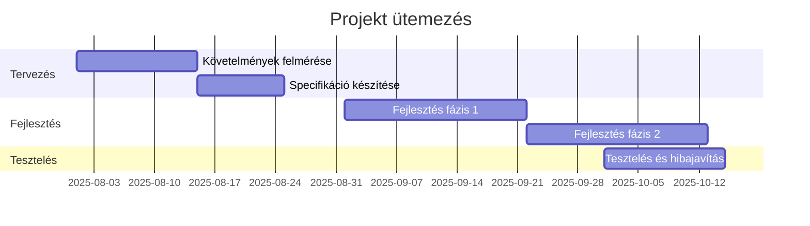

# Gannt Diagram

```mermaid
gantt
    title Projekt ütemezés
    dateFormat  YYYY-MM-DD
    axisFormat  %Y-%m-%d

    section Tervezés
    Követelmények felmérése :a1, 2025-08-01, 14d
    Specifikáció készítése :a2, after a1, 10d

    section Fejlesztés
    Fejlesztés fázis 1 :b1, 2025-09-01, 21d
    Fejlesztés fázis 2 :b2, after b1, 21d

    section Tesztelés
    Tesztelés és hibajavítás :c1, 2025-10-01, 14d
```
