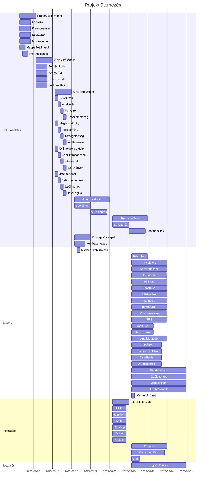

# Gannt Diagram

```mermaid
gantt
    title Projekt ütemezés
    dateFormat  YYYY-MM-DD
    axisFormat  %Y-%m-%d

    section Dokumentálás
    Pro.terv elkészítése :a1, 2025-07-01, 6d
        Eszközök:a2, 2025-07-01, 4d
        Komponensek:a3, 2025-07-01, 4d
        Struktúrák:a4, 2025-07-01, 4d
        Munkanapló:a5, 2025-07-01, 4d
        MappaBeállítások:a6, 2025-07-01, 2d
        ymlBeállítások:a7, 2025-07-02, 2d

    Vízió elkészítése:a8, 2025-07-07, 6d
        Bev. és Prob.:a9, 2025-07-07, 4d
        Jav. és Term.:a10, 2025-07-07, 4d
        Felh. és Hat.:a11, 2025-07-07, 4d
        Kock. és Felt.:a12, 2025-07-07, 4d

    SRS elkészítése:a13, 2025-07-14, 6d
        Bevezetés:a14, 2025-07-14, 1d
        Áttekintés:a15, after a14, 1d
        Funkciók:a16, after a15, 1d
        Használhatóság:a17, after a16, 1d
        Megbízhatóság:a18, 2025-07-14, 1d
        Teljesítmény:a19, after a18, 1d
        Támogatottság:a20, after a19, 1d
        Korlátozások:a21, after a20, 1d
        Online dok és Help:a22, 2025-07-14, 1d
        Kész komponensek:a23, after a22, 1d
        Interfészek:a24, after a23, 1d
        Szabványok:a25, after a24, 1d
        Játéktörténet:a26, 2025-07-14, 1d
        Játékmechanika:a27, after a26, 1d
        Játékmenet:a28, after a27, 1d
        Játéklogika:a29, after a28, 1d

    Analízis Model:a32, 2025-07-21, 13d
        Bev és dia:a33, 2025-07-21, 6d
        Alr. és ábrák:a34, after a33, 6d

    RendszerTerv:a35, 2025-08-04, 13d
        Bevezetés:a36, 2025-08-04, 6d
        Adatmodellek:a37, after a36, 6d

    Koncepciós Képek:a30, 2025-07-21, 6d
        Képátszervezés:a31, 2025-07-21, 4d


    section Javítás
    Mkdocs Stabilizálása:b1, 2025-07-22, 1d

    Rdsz.Terv: b2, 2025-08-11, 6d

    Projektterv: b3, 2025-08-11, 13d
        Komponensek:b4, 2025-08-11, 13d
        Eszközök:b5, 2025-08-11, 13d
        Fejl.terv:b6, 2025-08-11, 13d
        Tesztelés:b7, 2025-08-11, 13d
        Mértus link:b8, 2025-08-11, 13d
        gannt dia:b9, 2025-08-11, 13d
        referenciák:b10, 2025-08-11, 13d

    Vízió use-case:b11, 2025-08-11, 13d
    SRS:b12, 2025-08-11, 13d
        Több kép:b13, 2025-08-11, 8d
        Gazd.Szituk:b14, 2025-08-11, 8d

    AnalízisModel:b15, 2025-08-11, 13d
        ArchÁbra:b16, 2025-08-11, 11d
        KompKapcsolatok:b17, 2025-08-11, 11d
        Osztálydia:b18, 2025-08-11, 11d
        Alrendszerek:b19, 2025-08-11, 11d

    RendszerTerv:b20, 2025-08-11, 20d
        Játékmentés:b21, 2025-08-11, 20d
        Játékosjson:b22, 2025-08-11, 20d
        FőbbModulok:b23, 2025-08-11, 20d

    WarningSzöveg:b24, 2025-08-11, 1d

    section Fejlesztés
    Tscn kidolgozás:c1, 2025-08-04, 6d
        HUD:c2, 2025-08-04, 5d
        MainMenu:c3, 2025-08-04, 5d
        Shop:c4, 2025-08-04, 5d
        Carshop:c5, 2025-08-04, 5d
        Office:c6, 2025-08-04, 5d
        Gulag:c7, 2025-08-04, 5d
    Scriptek:c8, 2025-08-11, 13d
        Kommentelés:c9, 2025-08-11, 12d
        Audio:c10, 2025-08-11, 3d
    section Tesztelés
    Egységtesztek:d1, 2025-08-11, 20d
```
